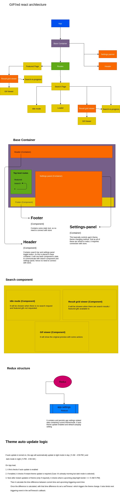

# Project GIFt'ed

## Dev execution steps

>Note: Requires Node >= 11

```
npm i
npm run start
```
or 
```
yarn
yarn start
```

## Features

1. User can search gifs
2. User can browse through featured gifs
3. Infinte scroll makes user experience smoother
4. Fully responsive
5. User can switch between `dark / light mode`
6. Themes can be switched automatically based on time ( 5 AM & 5 PM )
7. User can select to load animated / still gifs
8. Quick links are provided (socail links, copy to clipboard & embed code)
9. No 3rd party UI library included (UI development code is available with git logs in a seperate directory)

